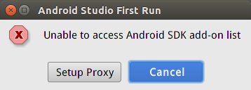

# 1. 说明

本文所述以android studio 1.5/1.5.1正式版为安装对象。对于以前的版本，以及以后更新的版本，不见得适用，未对其他版本做安装验证！  

# 2. 下载

官网下载地址：[http://developer.android.com/sdk/index.html](http://developer.android.com/sdk/index.html)。但是这个地址目前无法下载（虽然已经改了hosts，可以上谷歌等）  

其『他下载地址：[http://www.androiddevtools.cn/](http://www.androiddevtools.cn/)。我就是从这个地方下载的。而且这里提供了一些国内的镜像地址。  

## 2.1 windows版下载

请下载android-studio-bundle-141.2343393-windows.exe这个（1.6G）。这个包含了sdk等，目前这个是安装成功了。  

不包含sdk的android-studio-ide-141.2343393-windows.zip目前没有安装成功（无法更新），也没有再测试。后来根据linux成功的经验，再下载独立的sdk包，按照linux类似的步骤，估计应该也可以成功。  

## 2.2 linux版下载

studio： android-studio-ide-141.2456560-linux.zip  
sdk： android-sdk_r24.3.4-linux.tgz  
platform-tools：platform-tools_r22-linux.zip  

# 3. 安装

## 3.1 windows版安装

直接执行下载的安装程序即可。  

## 3.2 linux版安装

将下载后的studio和sdk压缩包分别解压到想放置的目录中。platform-tools压缩包解压出来的platform-tools文件夹放在sdk根目录下。  
运行[studio]/bin/studio进行安装。安装过程中若碰到如下的错误，直接cancel，直到最后安装完成，出现欢迎界面。  
  

在studio的欢迎界面，依次选择『Projects Default』、『Project Structure』，在显示的界面中，修改『Android SDK location』的目录为前面sdk解压后的目录。点击『Apply』按钮，应用修改。  

# 4. 配置sdk相关更新

windows版和linux版的配置过程相同，就统一描述了。  

在studio的欢迎界面，依次选择『SDK Manager』、『Appearance & Behavior』、『System Settings』、『HTTP Proxy』（中间若有卡顿，请耐心等待）。  

在右侧的操作界面依次选择『Manual proxy configuration』、『HTTP』。  
（我这里用的是[http://www.androiddevtools.cn/](http://www.androiddevtools.cn/)中提供的中科院的镜像，当然也可以尝试使用其他的。）  
在『Host Name』中输入mirrors.opencas.cn；『Port number』中输入80。  
点击『Apply』按钮，应用修改。  

在左侧的树状列表中选择『Android SDK』，在右侧选择『SDK Update Sites』选项页。  
选中下部的『Force https://...sources to be fetched using http://...』  
点击右边的『+』，在弹出的对话框的『Name』中输入任意的名字，在『URL』中输入[http://mirrors.opencas.cn](http://mirrors.opencas.cn)。点击『OK』按钮返回。  
列表中就会出现刚添加的信息。点击『Apply』按钮，应用修改。稍等片刻，就会出来一些可用的网址。  
我这的现实情况是出来的可用网址都是google的http协议的，所以怀疑不需要添加网址，只要勾选『Force https://...sources to be fetched using http://...』并应用应该就可以了。  

到了这里，配置也就完成了。  

后面就可以选择『SDK Platforms』、『SDK Tools』里面的想安装的项，然后点击『Apply』进行更新了。  

